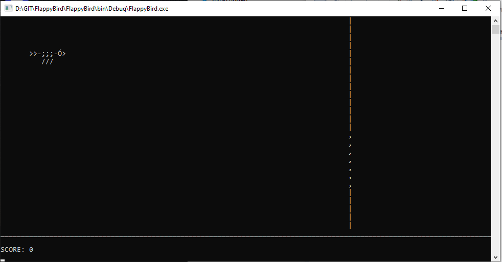

# ASCIFlappyBird
## FlappyBird in Command Prompt made from ASCI characters
This is a C# version of "Flappy Bird" that runs in the Command Prompt using ASCII characters. Players use keyboard inputs to navigate a bird through ASCII obstacles, aiming for a high score.
## Screenshots

